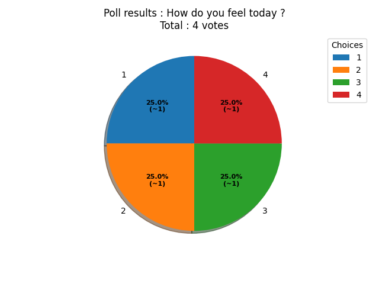
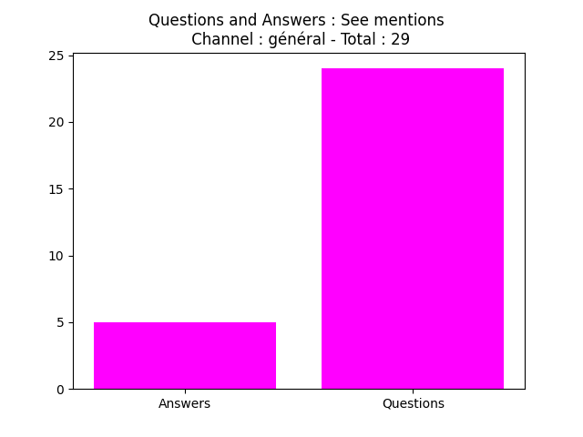
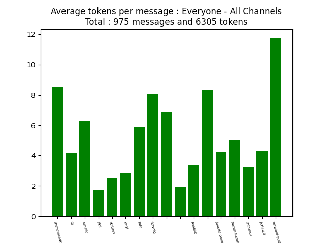

# A bot made to size your speech
<p align="justify">This project is made as part of the final evaluation of python classes for the master 2 NLP Inalco 2020-2021. The goal of this project is to learn the using and implementation of complex api using python and linking it with NLP tasks. So we decided to make some statistics to help people having troubles with (for instance people thinking that among us impostors are not random).</p>

# Installation 
### First

This bot requires few python's external modules in order to work. We recommend using pip for a simple and fast installation.
You can copy paste the following lines into your command line or make the installation by yourself.  

```bash
pip install discord;
pip install python-dotenv;
pip install numpy;
pip install logging;
pip install matplotlib;
pip install asyncio;
```

### Then

<p align="justify">Once you're done with packages, you can download the last release and unzip it to the desired directory. Then you must edit the '.env' file located in the root directory of the unziped content and use your bot token to replace the field "YOUR_TOKEN". You're now ready to launch the bot through the command line !  
However, you'd better read what commands you can use before...</p>

# How it works
### At start

<p align="justify">When the bot is started, it will automatically save the whole chat history of every channel of every server it has access to. This operation can take some time considering the number of messages posted since the guild creation and the amount of guilds the bot manages. It will create a csv file for each channel in the ./guild/"guild_name" directory. The bot is set to refresh files every 12 hours or after being restarted. By default, the script logs basic events, warning and errors into a log file located at the root. To prevent it from creating a log file that could take some disk space, you can remove the "Logging" part inside 'bot.py'.</p>

### At the end

You can stop the bot by closing the tab where the bot is running. Deleting any file inside the '.guilds/' or '.graph/' directories wont cause any trouble. You should delete the log file if you think it grew too much.  

# Commands
Note that useable commands will be shown only in the second part of this section.  
## Explanations
### !stats

The main command used for each bot feature. Every command only uses the data collected from the contextual channel (the channel from where the command was sent) unless the global option is used.  
```!stats
```

### global

This is the only option you can add next to the main command. It brings every text channel data together to make the statistics you want to show.  
```!stats global
```

### message gif q&a token vs poll

There are a lot of different features that can be used next to the main command, as the first parameter :    

- message : Shows through a simple line plot the number of messages posted by date.  
- gif : Shows through a line plot the number of gifs posted by date.  
- q&a : Shows into a simple bar plot the number of questions and answers posted.  
- token : Shows into a bar plot the average number of tokens per message posted.  
- vs : Shows through a pie chart the proportion of messages and gifs posted.  
- poll : Start a poll in the current channel using reactions and create a simple pie chart when the set timer is over.    

Examples :

```!stats message
!stats q&a
!stats global gif
```

### one everyone + vs role

The second parameter is used to choose how users data will be managed :    

- one : Makes statistics using only one user data.  
- everyone : Uses every user statistics.  
- \+ : Add selected users statistics together.  
- vs : Compare user statistics inside a pie chart. This parameter does only work with message or gif.  
- role : Compare number of post for each role of the guild. This parameter does only work with message or gif.    

Examples :

```!stats message everyone
!stats q&a one
!stats global message +
```

### mentions

At the end of each command, you have to use one or multiple mentions (@user) to specify on which user the command will process !    

You can use multiple mentions with the 'one' parameter, it will generate multiple plot.  

The 'everyone' parameter does not need any mention.  
The '+' parameter needs at least two mentions or the results will be the same as using the 'one' parameter.  
The 'vs' parameter does only work for message and gif.  

### poll

<p align="justify">The poll feature is a bit different from others. It takes two parameters :<br/>
Time : The amount of second before the poll ends. Once the poll ends the plot will be send on text channel.<br/>
Question : The question being the subject of the poll.<br/>
If you don't use more arguments, the poll will consider the question answers being only yes or no.<br/>
Then you can add between one to five optional arguments as possible answers.</p>


```!stats poll 60 "Question" "Answer1" "Answer2" "Answer3"```  
  

## Full command examples

Now you understand how the commands set works you'll be able to find what fills your needs !

Do you want to know the total of messages posted on your server ? 

```!stats global message everyone```  

Do you need to know how many gifs you posted today to realize if you are boring people ?

```!stats gif one @myname```  

Do you want to know who is the biggest flooder between two people ?

```!stats message vs @firstname @secondname ```  

Do you need to vote to choose what game you're playing next ?

```!stats poll 30 "What we play next ?" "Among Us" "PUBG" "Monster Hunter" "I'd better do my homeworks"```  

## Detail of each feature
### message gif
<p align="justify">Returns a line plot based on message posted by date. If there are too many dates, the plot will skip dates to make ticks readable.
Only discord integrated gifs are counted. A message containing external gif url will count as only one message.  
The plot also specifies the total of messages or gifs posted.</p>

```!stats global message everyone```  
  

### q&a
<p align="justify">Returns a bar plot with two fields : questions and answers.  
We consider as one question every message containing at least one interrogation point. Only messages using discord integrated answer feature are counted as answer. 
The plot also specifies the total of questions + answers posted.</p>

```!stats q&a + @firstperson @secondperson```  
  

### token
<p align="justify">Returns a bar plot of the average of token per message posted per user.
Every string between two spaces is considered as one token, what means that an url is one token.
The plot also specifies the total of tokens and messages posted.</p>

```!stats global token everyone```  
  

### vs
Returns a pie chart of the number of messages compared to the number of gifs posted.
The plot also specifies the total of messages + gifs posted.
```!stats vs```  
[message_plot](./graph/example/stats_vs.png)

### message role | gif role
Returns a pie chart of the total of messages + gifs posted per role. If there are too many role on the server, the plot may have lisibility issues.
Also specifies the total of messages posted.
```!stats message role```  
[message_plot](./graph/example/stats_message_role.png)

### message vs | gif vs
Returns a pie chart of the total of messages or gif posted per mentionned users. If there are too many users mentionned, the plot may have lisibility issues.
Also specifies the total of messages posted by mentionned users.
```!stats messages vs @Arthur.B @camille @Juliette```  
[message_plot](./graph/example/stats_message_vs.png)

# Contact
discord : Arthur.B#2688

## Licences
[Python](https://docs.python.org/3/license.html)  
[Discord](https://discord.com/licenses)
